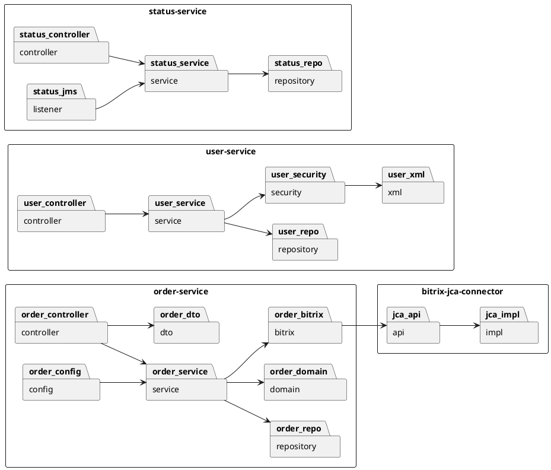
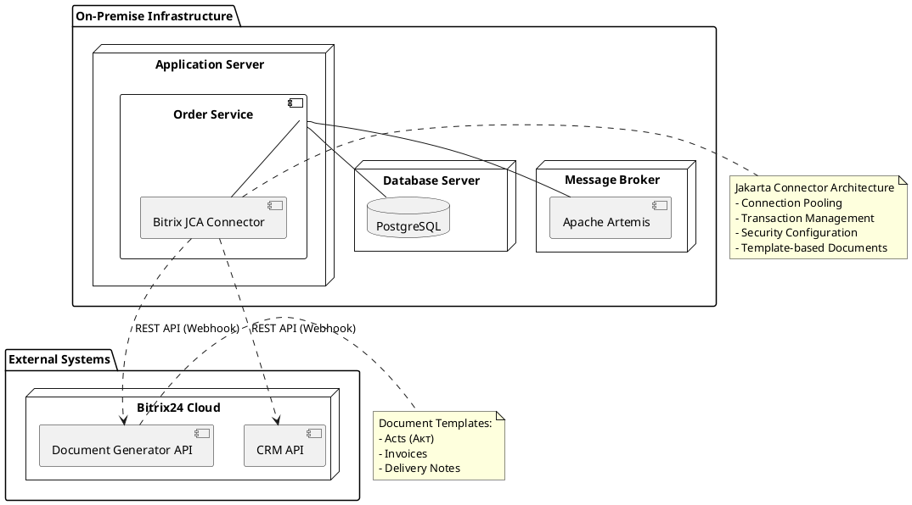

<div align="center">

Федеральное государственное автономное образовательное учреждение высшего образования

Университет ИТМО

</div>

**Факультет:** ПИиКТ

<div align="center">

Дисциплина: **Бизнес-логика программных систем**

# Лабораторная работа №1

## Автоматизация бизнес-процесса выдачи заказа

**Вариант:** 3201

</div>

**Выполнили:** Амузинский Артем, Тараненко Максим

**Группа:** P3306, P3311

**Преподаватель:** Кривоносов Егор Дмитриевич

<div align="center">


2026 г.  
Санкт-Петербург

</div>

<div style="page-break-after: always;"></div>

# Отчёт по лабораторной работе
## Разработка системы управления складом и выдачей заказов (BLSS)

---

## 1. Текст задания

Разработать информационную систему автоматизации бизнес-процесса выдачи заказов в пунктах выдачи заказов (ПВЗ). Система должна обеспечивать:

- Управление товарным ассортиментом и складскими остатками
- Создание и сопровождение заказов клиентов
- Резервирование товаров при оформлении заказа
- Подготовку товаров к выдаче (назначение ячеек хранения)
- Отслеживание статусов заказа на всём протяжении жизненного цикла
- Выдачу заказа клиенту в пункте выдачи
- Интеграцию с внешней системой (Bitrix24) для генерации документов
- Асинхронное взаимодействие между сервисами через JMS

**Технические требования:**
- Микросервисная архитектура
- REST API для внешнего взаимодействия
- JMS для асинхронной коммуникации
- Jakarta Connector Architecture (JCA) для интеграции с EIS
- Quartz для планирования задач
- PostgreSQL в качестве СУБД
- Spring Boot 3.x, Java 17

---

## 2. Модель потока управления для автоматизируемого бизнес-процесса

### 2.1. BPMN-диаграмма бизнес-процесса

Бизнес-процесс выдачи заказа описан в файле `docs/diagram (1).bpmn` и включает следующие этапы:

```
┌─────────────────────────────────────────────────────────────────────────────┐
│                           БИЗНЕС-ПРОЦЕСС "ВЫДАЧА ЗАКАЗА"                    │
└─────────────────────────────────────────────────────────────────────────────┘

┌──────────────┐     ┌──────────────┐     ┌──────────────┐
│   КЛИЕНТ     │     │ КОНСУЛЬТАНТ  │     │   СКЛАД      │
│              │     │              │     │              │
│  Создание    │────▶│  Проверка    │────▶│  Резервиров. │
│  заказа      │     │  заказа      │     │  товара      │
│              │     │              │     │              │
│              │     │  Подготовка  │◀────│  Назначение  │
│              │◀────│  к выдаче    │     │  ячейки      │
│              │     │              │     │              │
│  Получение   │◀────│  Выдача      │────▶│  Списание    │
│  заказа      │     │  заказа      │     │  остатков    │
│              │     │              │     │              │
└──────────────┘     └──────────────┘     └──────────────┘
```

### 2.3. Описание этапов процесса

| Этап | Действие | Ответственный | Система |
|------|----------|---------------|---------|
| 1 | Создание заказа | Консультант | Order Service |
| 2 | Проверка доступности товаров | Система | Order Service |
| 3 | Резервирование товаров | Система | Inventory Service |
| 4 | Назначение ячеек хранения | Кладовщик | Storage Service |
| 5 | Подготовка к выдаче | Кладовщик | Order Service |
| 6 | Уведомление клиента | Система | Notification Service |
| 7 | Выдача заказа | Консультант | PVZ Service |
| 8 | Генерация документов | Система | Bitrix24 (JCA) |

---

## 3. UML-диаграммы классов и пакетов разработанного приложения

### 3.1. Диаграмма пакетов



### 3.2. Диаграмма классов (основные сущности)

```plantuml
@startuml
left to right direction

' ==========================================
' DOMAIN ENTITIES
' ==========================================
class Order {
    -id: UUID
    -status: Status
    -owner: String
    -location: UUID
    -totalAmount: BigDecimal
    -creationDate: Instant
    -lastEdited: Instant
    +getId(): UUID
    +getStatus(): Status
    +getOwner(): String
    +getLocation(): UUID
    +getTotalAmount(): BigDecimal
}

class OrderItem {
    -id: UUID
    -orderId: UUID
    -productId: UUID
    -yacheyka: String
    +getId(): UUID
    +getOrderId(): UUID
    +getProductId(): UUID
    +getYacheyka(): String
}

class Product {
    -id: UUID
    -name: String
    -price: BigDecimal
    +getId(): UUID
    +getName(): String
    +getPrice(): BigDecimal
}

class StoreItem {
    -productId: UUID
    -count: Integer
    +getProductId(): UUID
    +getCount(): Integer
}

class User {
    -id: UUID
    -email: String
    +getId(): UUID
    +getEmail(): String
}

class DeliveryPoint {
    -id: UUID
    -name: String
    -address: String
    +getId(): UUID
    +getName(): String
    +getAddress(): String
}

enum Status {
    CREATED
    PROCESSING
    IN_DELIVERY
    READY_FOR_PICKUP
    CANCELED
    DONE
}

' Domain relationships
Order ||--o{ OrderItem : contains
OrderItem }o--|| Product : references
Product ||--|| StoreItem : has inventory
Order }o--|| User : placed by
Order }o--|| DeliveryPoint : delivered to
Order --> Status : has status

' ==========================================
' CONTROLLERS
' ==========================================
class OrderController {
    -orderService: OrderService
    -orderStatusUpdater: OrderStatusUpdater
    -orderDocumentSyncService: OrderDocumentSyncService
    -dtoMapper: DtoMapper
    +createOrder(): OrderCreationResponse
    +getOrderById(): GetOrderResponse
    +nextStatus(): void
    +cancelOrder(): void
    +syncOrderDocumentToBitrix(): void
}

class InventoryController {
    -storeService: StoreService
    -dtoMapper: DtoMapper
    +createProduct(): InventoryProductDto
    +updateProduct(): InventoryProductDto
    +updateCount(): InventoryProductDto
    +getProduct(): InventoryProductDto
    +getAllProducts(): List<Dto>
}

class DeliveryPointController {
    -deliveryPointRegistry: DeliveryPointRegistry
    +createDeliveryPoint(): DeliveryPointResponse
}

class PVZController {
    -storageService: StorageService
    +markDelivered(): void
}

class UserController {
    -registrationController: RegistrationController
    +registerUser(): UserResponse
}

class ReportController {
    -reportService: ReportService
    +getStatistics(): StatisticsResponse
}

' ==========================================
' SERVICES
' ==========================================
class OrderService {
    -productRepo: ProductRepo
    -storeRepo: StoreRepo
    -orderRepo: OrderRepo
    -orderItemRepo: OrderItemRepo
    -userServiceClient: UserServiceClient
    -transactionExecutor: TransactionExecutor
    +createOrder(): CreationOrderResponse
    +getStatus(): Status
    +updateStatus(): void
    +getOrderContentById(): FullOrder
}

class StoreService {
    -productRepo: ProductRepo
    -storeRepo: StoreRepo
    +createProduct(): UUID
    +updateProduct(): void
    +updateItemsCount(): void
    +getProduct(): Product
    +getAllProducts(): List<Product>
}

class OrderStatusUpdater {
    -orderRepo: OrderRepo
    -orderStatusProducer: OrderStatusProducer
    +next(): void
    +cancel(): void
}

class OrderDocumentSyncService {
    -orderRepo: OrderRepo
    -orderItemRepo: OrderItemRepo
    -productRepo: ProductRepo
    -deliveryPointRepo: DeliveryPointRepo
    -connectionFactory: BitrixConnectionFactory
    +sendOrderDocument(): void
}

class DeliveryPointRegistry {
    -deliveryPointRepo: DeliveryPointRepo
    +createDeliveryPoint(): DeliveryPoint
}

class StorageService {
    -orderItemRepo: OrderItemRepo
    -orderStatusUpdater: OrderStatusUpdater
    +markDelivered(): void
}

class ReportService {
    -orderRepo: OrderRepo
    +generateReport(): Statistic
    +streamOrdersForDay(): Stream<Order>
}

' ==========================================
' REPOSITORIES
' ==========================================
interface OrderRepo {
    +findById(): Optional<Order>
    +create(): Order
    +updateStatus(): Optional<Order>
    +findOrdersForDay(): List<Order>
}

interface OrderItemRepo {
    +findAllByOrderId(): List<OrderItem>
    +create(): OrderItem
}

interface ProductRepo {
    +findAllById(): Iterable<Product>
    +save(): Product
}

interface StoreRepo {
    +decrementCount(): void
    +getCount(): Integer
}

interface DeliveryPointRepo {
    +findById(): Optional<DeliveryPoint>
    +create(): DeliveryPoint
}

interface UserRepo {
    +findByUsername(): Optional<User>
    +create(): User
}

' ==========================================
' DTOs
' ==========================================
class OrderCreateRequestDTO {
    -owner: String
    -location: UUID
    -productIds: List<UUID>
}

class OrderCreationResponse {
    -orderId: UUID
}

class GetOrderResponse {
    -id: UUID
    -owner: String
    -status: Status
    -totalAmount: BigDecimal
}

class ProductCreateRequestDto {
    -name: String
    -price: BigDecimal
    -initialCount: Integer
}

class InventoryProductDto {
    -id: UUID
    -name: String
    -price: BigDecimal
    -count: Integer
}

' ==========================================
' BITRIX JCA
' ==========================================
class BitrixConnectionFactory {
    +getConnection(): BitrixConnection
}

interface BitrixConnection {
    +createDocument(): String
    +createCrmDeal(): String
    +callMethod(): Map
}

class BitrixOrderItem {
    -itemId: UUID
    -productId: UUID
    -productName: String
    -price: BigDecimal
    -quantity: Integer
    -yacheyka: String
}

' ==========================================
' RELATIONSHIPS - Controllers to Services
' ==========================================
OrderController --> OrderService
OrderController --> OrderStatusUpdater
OrderController --> OrderDocumentSyncService
InventoryController --> StoreService
DeliveryPointController --> DeliveryPointRegistry
PVZController --> StorageService
ReportController --> ReportService

' ==========================================
' RELATIONSHIPS - Services to Repositories
' ==========================================
OrderService --> OrderRepo
OrderService --> OrderItemRepo
OrderService --> ProductRepo
OrderService --> StoreRepo
StoreService --> ProductRepo
StoreService --> StoreRepo
OrderStatusUpdater --> OrderRepo
OrderDocumentSyncService --> OrderRepo
OrderDocumentSyncService --> BitrixConnectionFactory
DeliveryPointRegistry --> DeliveryPointRepo
StorageService --> OrderItemRepo
ReportService --> OrderRepo

' ==========================================
' RELATIONSHIPS - Controllers to DTOs
' ==========================================
OrderController ..> OrderCreateRequestDTO : uses
OrderController ..> OrderCreationResponse : returns
OrderController ..> GetOrderResponse : returns
InventoryController ..> ProductCreateRequestDto : uses
InventoryController ..> InventoryProductDto : returns

' ==========================================
' RELATIONSHIPS - JCA
' ==========================================
OrderDocumentSyncService --> BitrixConnectionFactory
BitrixConnectionFactory ..> BitrixConnection : creates
BitrixConnection ..> BitrixOrderItem : uses

@enduml
```



### 3.3. Архитектура микросервисов

```
┌─────────────────────────────────────────────────────────────────────────────┐
│                              BLSS Architecture                              │
└─────────────────────────────────────────────────────────────────────────────┘

                    ┌─────────────────┐
                    │   API Gateway   │
                    │   (Port 8080)   │
                    └────────┬────────┘
                             │
        ┌────────────────────┼────────────────────┐
        │                    │                    │
        ▼                    ▼                    ▼
┌───────────────┐   ┌───────────────┐   ┌───────────────┐
│ Order Service │   │ User Service  │   │Status Service │
│   (25103)     │   │   (25104)     │   │   (25105)     │
│               │   │               │   │               │
│ - Orders      │   │ - Users       │   │ - Status      │
│ - Inventory   │   │ - Auth        │   │ - History     │
│ - Bitrix JCA  │   │ - XML Store   │   │ - JMS Listener│
└───────┬───────┘   └───────┬───────┘   └───────┬───────┘
        │                   │                   │
        └───────────────────┼───────────────────┘
                            │
        ┌───────────────────┼───────────────────┐
        │                   │                   │
        ▼                   ▼                   ▼
┌───────────────┐   ┌───────────────┐   ┌───────────────┐
│  PostgreSQL   │   │ Apache Artemis│   │   Bitrix24    │
│   (5432)      │   │   (61616)     │   │   (REST API)  │
│               │   │               │   │               │
│ - Orders      │   │ - JMS Queue   │   │ - Documents   │
│ - Products    │   │ - Messages    │   │ - CRM Deals   │
│ - Users       │   │ - Events      │   │ - Templates   │
└───────────────┘   └───────────────┘   └───────────────┘
```

---

## 4. Спецификация REST API для всех публичных интерфейсов

### 4.1. Order Service (Port 25103)

#### Управление заказами

| Метод | Endpoint | Описание | Roles | Request Body | Response |
|-------|----------|----------|-------|--------------|----------|
| `POST` | `/order/create` | Создание заказа | USER, CONSULTANT, MANAGER, ADMIN | `OrderCreateRequestDTO`<br/>- `owner: String`<br/>- `location: UUID`<br/>- `productIds: List<UUID>` | `OrderCreationResponse`<br/>- `orderId: UUID` |
| `GET` | `/order/{id}` | Получение деталей заказа | All | Path: `id: UUID` | `GetOrderResponse`<br/>- `id: UUID`<br/>- `owner: String`<br/>- `status: Status`<br/>- `totalAmount: BigDecimal`<br/>- `positions: List<FullOrderItem>` |
| `PATCH` | `/order/{id}/status/next` | Переход к следующему статусу | CONSULTANT, MANAGER, ADMIN | Path: `id: UUID` | `204 No Content` |
| `PATCH` | `/order/{id}/status/cancel` | Отмена заказа | CONSULTANT, MANAGER, ADMIN | Path: `id: UUID` | `204 No Content` |
| `POST` | `/order/{id}/bitrix-document` | Синхронизация документа с Bitrix24 | CONSULTANT, MANAGER, ADMIN | Path: `id: UUID` | `202 Accepted` |

#### Управление инвентарём

| Метод | Endpoint | Описание | Roles | Request Body | Response |
|-------|----------|----------|-------|--------------|----------|
| `POST` | `/inventory/products` | Создание товара | ADMIN, MANAGER, WAREHOUSE | `ProductCreateRequestDto`<br/>- `name: String`<br/>- `price: BigDecimal`<br/>- `initialCount: Integer` | `InventoryProductDto`<br/>- `id: UUID`<br/>- `name: String`<br/>- `price: BigDecimal`<br/>- `count: Integer` |
| `PUT` | `/inventory/products/{id}` | Обновление товара | ADMIN, MANAGER, WAREHOUSE | Path: `id: UUID`<br/>Body: `ProductUpdateRequestDto` | `InventoryProductDto` |
| `PATCH` | `/inventory/products/{id}/count` | Изменение остатка | ADMIN, MANAGER, WAREHOUSE | Path: `id: UUID`<br/>Query: `change: Integer` | `InventoryProductDto` |
| `GET` | `/inventory/products/{id}` | Получение товара | All | Path: `id: UUID` | `InventoryProductDto` |
| `GET` | `/inventory/products` | Список всех товаров | All | - | `List<InventoryProductDto>` |
| `GET` | `/inventory/products/{id}/count` | Получение остатка | All | Path: `id: UUID` | `Integer` |

#### ПВЗ (Пункты выдачи заказов)

| Метод | Endpoint | Описание | Roles | Request Body | Response |
|-------|----------|----------|-------|--------------|----------|
| `POST` | `/mark-delivered` | Отметка доставки позиции | All | `OrderItemDeliveredDto`<br/>- `orderItemId: UUID` | `204 No Content` |

### 4.2. User Service (Port 25104)

| Метод | Endpoint | Описание | Roles | Request Body | Response |
|-------|----------|----------|-------|--------------|----------|
| `POST` | `/users` | Регистрация пользователя | ADMIN | `UserCreateRequestDto`<br/>- `email: String`<br/>- `password: String` | `UserResponse`<br/>- `id: UUID`<br/>- `email: String` |
| `GET` | `/users/internal/{username}` | Проверка существования (внутренний) | Internal | Path: `username: String` | `Boolean` |

### 4.3. Status Service (Port 25105)

| Метод | Endpoint | Описание | Roles | Request Body | Response |
|-------|----------|----------|-------|--------------|----------|
| `GET` | `/health` | Проверка здоровья сервиса | All | - | `HealthStatus` |
| `GET` | `/status-history/{orderId}` | История статусов заказа | All | Path: `orderId: UUID` | `List<StatusChange>` |
| `POST` | `/status-history` | Добавление записи истории (внутренний) | Internal | `StatusChangeEvent` | `201 Created` |

### 4.4. Коды статусов заказа

| Код | Описание |
|-----|----------|
| `CREATED` | Заказ создан |
| `PROCESSING` | Заказ в обработке |
| `IN_DELIVERY` | Заказ в доставке |
| `READY_FOR_PICKUP` | Готов к выдаче |
| `CANCELED` | Отменён |
| `DONE` | Выдан |

---

## 5. Диаграмма развёртывания (Deployment Diagram)

### 5.1. Интеграция с Bitrix24 через JCA



### 5.2. Физическое развёртывание

```
┌─────────────────────────────────────────────────────────────────────────────┐
│                         Production Environment                              │
└─────────────────────────────────────────────────────────────────────────────┘

┌─────────────────────┐     ┌─────────────────────┐     ┌─────────────────────┐
│   Order Service     │     │   User Service      │     │  Status Service     │
│   Docker Container  │     │  Docker Container   │     │  Docker Container   │
│                     │     │                     │     │                     │
│  Port: 25103        │     │  Port: 25104        │     │  Port: 25105        │
│  JVM: Java 17       │     │  JVM: Java 17       │     │  JVM: Java 17       │
│  Spring Boot 3.3.5  │     │  Spring Boot 3.3.5  │     │  Spring Boot 3.3.5  │
│                     │     │                     │     │                     │
│  [JCA Connector]    │     │  [XML User Store]   │     │  [JMS Listener]     │
└──────────┬──────────┘     └──────────┬──────────┘     └──────────┬──────────┘
           │                           │                           │
           │                           │                           │
           └───────────────────────────┼───────────────────────────┘
                                       │
           ┌───────────────────────────┼───────────────────────────┐
           │                           │                           │
           ▼                           ▼                           ▼
┌─────────────────────┐     ┌─────────────────────┐     ┌─────────────────────┐
│   PostgreSQL 15     │     │  Apache Artemis     │     │    Bitrix24 Cloud   │
│   Docker Container  │     │  Docker Container   │     │      (External)     │
│                     │     │                     │     │                     │
│  Port: 5432         │     │  Port: 61616 (JMS)  │     │  REST API           │
│  Database: studs    │     │  Port: 8161 (Web)   │     │  Webhook URL        │
│                     │     │                     │     │                     │
│  Tables:            │     │  Queues:            │     │  Endpoints:         │
│  - orders           │     │  - order.status.    │     │  - documentgenerator│
│  - order_items      │     │     changed         │     │    .document.add.json
│  - products         │     │                     │     │  - crm.deal.add.json│
│  - store            │     │                     │     │                     │
│  - users            │     │                     │     │                     │
│  - delivery_points  │     │                     │     │                     │
└─────────────────────┘     └─────────────────────┘     └─────────────────────┘
```

### 5.3. Компоненты интеграции с Bitrix24

| Компонент | Описание | Конфигурация |
|-----------|----------|--------------|
| **JCA Connector** | Адаптер для подключения к Bitrix24 REST API | `bitrix-jca-connector/` |
| **Connection Factory** | Фабрика соединений с пуллингом | `BitrixConnectionFactory` |
| **Managed Connection** | Управляемое соединение | `BitrixManagedConnection` |
| **Document Template** | Шаблон документа в Bitrix24 | Настраивается в UI Bitrix24 |
| **Webhook URL** | URL для аутентификации в Bitrix24 | `BITRIX_WEBHOOK_URL` |

---

## 6. Исходный код системы

### 6.1. Репозиторий

**GitHub:** https://github.com/GrozniyMax/blss

### 6.2. Структура проекта

```
blss/
├── order-service/                    # Основной сервис заказов
│   ├── src/main/java/com/blss/orderservice/
│   │   ├── controller/               # REST контроллеры
│   │   ├── service/                  # Бизнес-логика
│   │   ├── db/                       # Репозитории
│   │   ├── domain/                   # Доменные сущности
│   │   ├── dto/                      # DTO
│   │   ├── config/                   # Конфигурация (Quartz, JCA)
│   │   ├── bitrix/                   # Bitrix24 интеграция
│   │   ├── jms/                      # JMS продюсеры
│   │   └── client/                   # REST клиенты
│   └── src/main/resources/
│       ├── application.yaml          # Конфигурация
│       └── db/changelog/             # Liquibase миграции
│
├── user-service/                     # Сервис пользователей
│   ├── src/main/java/com/blss/userservice/
│   │   ├── controller/
│   │   ├── service/
│   │   ├── db/
│   │   ├── security/                 # JAAS + XML store
│   │   └── xml/                      # XML репозиторий
│   └── src/main/resources/
│
├── status-service/                   # Сервис истории статусов
│   ├── src/main/java/com/blss/statusservice/
│   │   ├── controller/
│   │   ├── service/
│   │   ├── db/
│   │   └── jms/                      # JMS консьюмеры
│   └── src/main/resources/
│
├── bitrix-jca-connector/             # JCA адаптер для Bitrix24
│   ├── src/main/java/com/blss/bitrixjca/
│   │   ├── api/                      # API интерфейсы
│   │   └── impl/                     # Реализация
│   └── src/main/resources/
│       └── META-INF/
│           └── ra.xml                # JCA descriptor
│
├── docker-compose.yml                # Оркестрация контейнеров
├── build.gradle.kts                  # Root build config
└── docs/                             # Документация
    ├── diagram (1).bpmn              # BPMN диаграмма
    ├── Доменная модель.md
    └── SECURITY.md
```

### 6.3. Ключевые технологии

| Технология | Версия | Назначение |
|------------|--------|------------|
| Java | 17 | Язык программирования |
| Spring Boot | 3.3.5 | Фреймворк |
| PostgreSQL | 15 | СУБД |
| Apache Artemis | Latest | JMS брокер |
| Liquibase | 4.27.0 | Миграции БД |
| Quartz | 2.3.2 | Планировщик задач |
| Jakarta EE | 2.1.0 | Connector Architecture |
| Lombok | Latest | Boilerplate reduction |

---

## 7. Выводы по работе

### 7.1. Достигнутые результаты

В ходе выполнения лабораторной работы была разработана полнофункциональная система управления складом и выдачей заказов со следующей функциональностью:

1. **Микросервисная архитектура**
   - Разделение на 3 независимых сервиса (Order, User, Status)
   - Изолированные базы данных для каждого сервиса
   - REST API для межсервисного взаимодействия

2. **Управление заказами**
   - Полный жизненный цикл заказа (6 статусов)
   - Резервирование товаров при создании
   - Валидация данных (существование пользователя, ПВЗ, товаров)

3. **Интеграция с внешними системами**
   - **Bitrix24 через JCA**: Генерация документов по шаблонам (акты, накладные)
   - **Apache Artemis**: Асинхронная отправка событий об изменении статусов
   - **Quartz Scheduler**: Планирование задач (генерация отчётов)

4. **Безопасность**
   - Spring Security с JAAS
   - Ролевая модель (ADMIN, MANAGER, CONSULTANT, WAREHOUSE, USER)
   - XML-хранилище пользователей для разработки

5. **Инфраструктура**
   - Docker Compose для развёртывания
   - Liquibase для управления миграциями БД
   - Health checks для мониторинга

### 7.2. Технические особенности реализации

**Jakarta Connector Architecture (JCA):**
- Реализован собственный JCA-адаптер для Bitrix24
- Поддержка connection pooling
- Интеграция с Spring через `@Resource` injection
- Конфигурация через `ra.xml` и Spring beans

**Quartz Scheduler:**
- RAM-based job store (без персистентности)
- Cron-расписание для задач
- Spring BeanJobFactory для DI в джобах

**JMS Messaging:**
- Продюсер-консьюмер паттерн
- События изменения статусов заказов
- Гарантированная доставка через Artemis

### 7.3. Проблемы и решения

| Проблема | Решение |
|----------|---------|
| Циклические зависимости в Quartz | Использование `@Lazy` injection |
| Внедрение зависимостей в Quartz Job | Кастомный `SpringBeanJobFactory` |
| Транзакционность между БД и JMS | `TransactionExecutor` с ручным управлением |
| Интеграция с Bitrix24 | JCA адаптер с маппингом полей шаблона |

### 7.4. Возможности расширения

1. **Персистентность Quartz**: Переход на JDBC job store для сохранения задач между рестартами
2. **Кластеризация**: Запуск нескольких инстансов сервисов с shared database
3. **Кеширование**: Redis для часто читаемых данных (товары, ПВЗ)
4. **Мониторинг**: Prometheus + Grafana для метрик
5. **CI/CD**: GitHub Actions для автоматического деплоя

### 7.5. Заключение

Разработанная система демонстрирует применение современных enterprise-паттернов:
- Микросервисы с чётким разделением ответственности
- Асинхронная коммуникация через JMS
- Интеграция с внешними EIS через JCA
- Планирование задач через Quartz
- Контейнеризация и оркестрация

Система готова к масштабированию и может быть расширена дополнительными сервисами (уведомления, аналитика, отчётность).