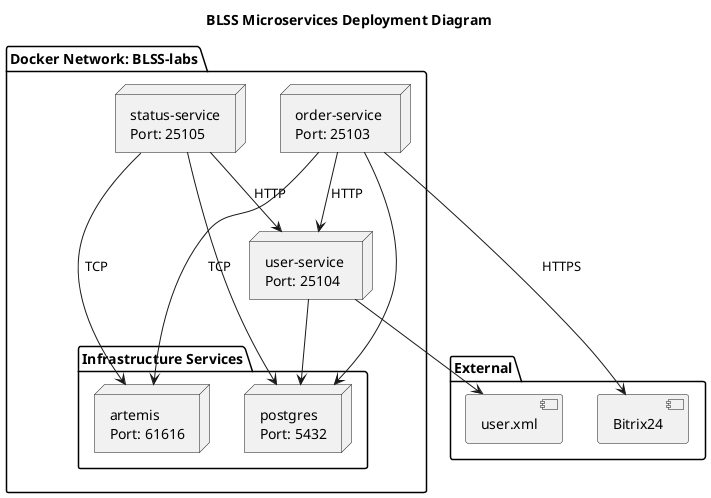

# Deployment Diagram

## BLSS Microservices Architecture



## Deployment Specification

### Infrastructure Components

| Component    | Port(s) | Protocol | Purpose                      |
|--------------|---------|----------|------------------------------|
| **postgres** | 5432    | TCP      | PostgreSQL database (shared) |
| **artemis**  | 61616   | TCP      | JMS message broker (shared)  |
| **pgadmin**  | 6980    | HTTP     | Database admin UI            |

### Application Services

| Service            | Port  | Protocol | Dependencies                                     |
|--------------------|-------|----------|--------------------------------------------------|
| **user-service**   | 25104 | HTTP     | PostgreSQL                                       |
| **order-service**  | 25103 | HTTP     | PostgreSQL, Artemis, user-service                |
| **status-service** | 25105 | HTTP     | PostgreSQL, Artemis, user-service, order-service |

### Network Architecture

```
┌─────────────────────────────────────────────────────────────┐
│                    External Network                         │
│  ┌──────────┐  ┌──────────┐  ┌──────────┐                  │
│  │ Browser  │  │ Bitrix24 │  │ pgAdmin  │                  │
│  └────┬─────┘  └────┬─────┘  └────┬─────┘                  │
│       │             │             │                         │
│       └─────────────┴─────────────┘                         │
│                     │                                       │
│       ┌─────────────▼─────────────┐                        │
│       │   Docker Bridge Network   │                        │
│       │      (BLSS-labs)          │                        │
│       │                           │                        │
│       │  ┌─────────────────────┐  │                        │
│       │  │  order-service      │  │                        │
│       │  │  :25103             │  │                        │
│       │  └─────────────────────┘  │                        │
│       │  ┌─────────────────────┐  │                        │
│       │  │  user-service       │  │                        │
│       │  │  :25104             │  │                        │
│       │  └─────────────────────┘  │                        │
│       │  ┌─────────────────────┐  │                        │
│       │  │  status-service     │  │                        │
│       │  │  :25105             │  │                        │
│       │  └─────────────────────┘  │                        │
│       │                           │                        │
│       │  ┌─────────────────────┐  │                        │
│       │  │  postgres           │  │                        │
│       │  │  :5432              │  │                        │
│       │  │  artemis            │  │                        │
│       │  │  :61616             │  │                        │
│       │  └─────────────────────┘  │                        │
│       └───────────────────────────┘                        │
└─────────────────────────────────────────────────────────────┘
```

### Communication Protocols

| Source         | Destination    | Protocol  | Port  | Purpose             |
|----------------|----------------|-----------|-------|---------------------|
| Client         | order-service  | HTTP/REST | 25103 | Order management    |
| Client         | user-service   | HTTP/REST | 25104 | User authentication |
| Client         | status-service | HTTP/REST | 25105 | Status history      |
| order-service  | user-service   | HTTP/REST | 25104 | User validation     |
| status-service | user-service   | HTTP/REST | 25104 | User validation     |
| status-service | order-service  | HTTP/REST | 25103 | Order lookup        |
| order-service  | artemis        | TCP/JMS   | 61616 | Publish events      |
| status-service | artemis        | TCP/JMS   | 61616 | Consume events      |
| All services   | postgres       | TCP/JDBC  | 5432  | Database access     |
| pgadmin        | postgres       | TCP/JDBC  | 5432  | Database admin      |

### Volume Mounts

| Volume        | Container Path           | Purpose                    |
|---------------|--------------------------|----------------------------|
| postgres_data | /var/lib/postgresql/data | Database persistence       |
| pgadmin_data  | /var/lib/pgadmin         | pgAdmin configuration      |
| artemis_data  | /var/lib/artemis         | Message broker persistence |

### Health Checks

| Service  | Type        | Interval | Timeout | Retries |
|----------|-------------|----------|---------|---------|
| postgres | pg_isready  | 15s      | 10s     | 5       |
| artemis  | TCP connect | 10s      | 5s      | 15      |

### Startup Order

```
1. postgres (with health check)
2. artemis (with health check)  
3. user-service (depends on postgres)
4. order-service (depends on postgres, artemis, user-service)
5. status-service (depends on postgres, artemis, order-service)
6. pgadmin (depends on postgres)
```

## Service Package Structure

### order-service (com.blss.orderservice)

```
controller → service → {db, jms, client, exception}
                    ↓
                 bitrix
```

### user-service (com.blss.userservice)

```
controller → {dto, security}
                    ↓
              jaas → xml
```

### status-service (com.blss.statusservice)

```
controller → service → {domain, db, dto, client}
                    ↑
                 jms
```

## Environment Variables

### Required Variables

```bash
# Database
POSTGRES_DB=studs
POSTGRES_USER=s408145
POSTGRES_PASSWORD=<password>

# Artemis JMS
ARTEMIS_USER=artemis
ARTEMIS_PASSWORD=artemis

# Service Ports
SERVER_PORT=25103  # order-service
SERVER_PORT=25104  # user-service
SERVER_PORT=25105  # status-service

# Service URLs (internal Docker network)
USER_SERVICE_URL=http://user-service:25104
ORDER_SERVICE_URL=http://order-service:25103
```
