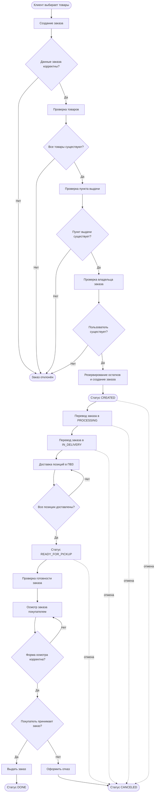
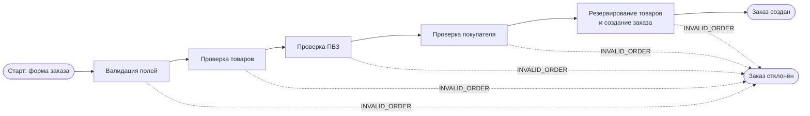
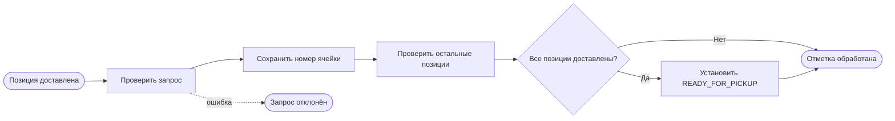
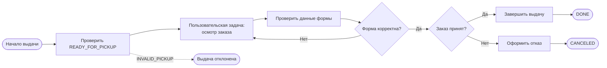
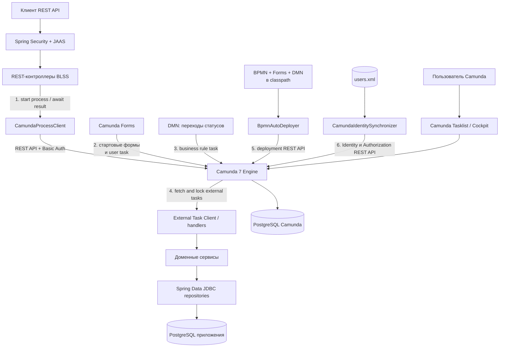

# Модель бизнес-процессов и архитектура BPM-интеграции

## 1. Назначение документа

Документ описывает актуальную модель потока управления автоматизируемого
бизнес-процесса, архитектуру приложения и точки интеграции с BPM-фреймворком
Camunda Platform 7.20. Также приведены изменения относительно модели,
разработанной в лабораторной работе №3.

Исходная концептуальная модель ЛР №3 находится в
`docs/diagram (1).bpmn`. Актуальные исполняемые модели находятся в
`src/main/resources/processes`.

## 2. Актуальная модель потока управления

### 2.1. Общая модель жизненного цикла заказа

Основной бизнес-процесс охватывает создание заказа, его обработку, доставку
позиций в пункт выдачи и передачу заказа покупателю.



Изменение статусов выполняется по правилам DMN
`order-status-transition.dmn`:

```text
CREATED -> PROCESSING -> IN_DELIVERY -> READY_FOR_PICKUP -> DONE
    \             \             \                  \
     +-------------+-------------+------------------> CANCELED
```

Переход в `CANCELED` разрешён из состояний `CREATED`, `PROCESSING`,
`IN_DELIVERY` и `READY_FOR_PICKUP`. Допустимость перехода определяется
DMN-решением `orderStatusTransition`, а изменение данных выполняется только
после получения разрешённого целевого статуса.

### 2.2. Процесс создания заказа

Исполняемая модель: `create-order.bpmn`.



В стартовой Camunda Form пользователь вводит владельца заказа, UUID пункта
выдачи и UUID продуктов. Список продуктов реализован компонентом
`dynamiclist`: для каждого продукта отображается отдельное поле, строки можно
добавлять и удалять. В процесс передаётся массив объектов с полем
`productId`; обработчик также поддерживает прежний формат массива строк UUID.

Финальная операция выполняется транзакционно: уменьшаются складские остатки,
создаётся заказ и создаются его позиции. При ошибке изменения базы данных
откатываются.

### 2.3. Процесс приёмки товара в пункте выдачи

Исполняемая модель: `mark-delivered.bpmn`.



Процесс отделяет доставку отдельных позиций от готовности всего заказа.
Заказ становится доступен к выдаче только после размещения всех его позиций.

### 2.4. Процесс выдачи заказа

Исполняемая модель: `order-pickup.bpmn`.



Осмотр является `userTask`, назначаемой группам `CONSULTANT`, `MANAGER` и
`ADMIN`. Если форма заполнена некорректно, процесс возвращается к этой же
пользовательской задаче, не завершая экземпляр процесса.

### 2.5. Вспомогательные исполняемые процессы

| Процесс | Назначение | Основные точки управления |
|---|---|---|
| `createProductProcess` | Создание товара и складской записи | Валидация, проверка дубликата, сохранение |
| `updateProductProcess` | Изменение названия и цены товара | Валидация и обновление либо BPMN-ошибка |
| `updateProductCountProcess` | Изменение складского остатка | Проверка допустимости и обновление |
| `createDeliveryPointProcess` | Создание пункта выдачи | Валидация и сохранение |
| `createOrderProcess` | Создание заказа | Последовательные проверки и транзакционное сохранение |
| `markDeliveredProcess` | Регистрация доставки позиции | Запись ячейки и проверка готовности заказа |
| `orderStatusProcess` | Управление статусом заказа | Загрузка статуса, DMN-решение, применение перехода |
| `orderPickupProcess` | Выдача или отказ от заказа | Проверка готовности, user task, развилка принятия |

Каждая автоматическая операция представлена external task. Бизнес-ошибки
передаются в Camunda через BPMN error и ведут к предусмотренному моделью
отрицательному завершению. Технические ошибки external task обрабатываются
механизмом повторных попыток.

## 3. Архитектура приложения и точки интеграции



### 3.1. Точки интеграции

1. **Запуск процессов из REST-контроллеров.**  
   `CamundaProcessClient` вызывает Camunda REST API
   `/process-definition/key/{key}/start`, передаёт переменные и ожидает
   появления результирующих переменных. Контроллеры остаются публичным API
   приложения, а порядок бизнес-операций задаётся BPMN-моделью.

2. **Camunda Forms.**  
   Формы из `src/main/resources/forms` используются для старта процессов и
   выполнения пользовательской задачи осмотра заказа. Они обеспечивают второй
   интерфейс работы с процессами через Tasklist.

3. **DMN-решение.**  
   `orderStatusProcess` вызывает таблицу решений
   `orderStatusTransition`. Правила переходов статусов вынесены из Java-кода и
   могут изменяться отдельно от структуры процесса и обработчиков.

4. **External Task Client.**  
   Camunda публикует задания по topics, например
   `create-order: check-products` или `order-pickup: complete`.
   Spring-компоненты с `@ExternalTaskSubscription` получают задания и вызывают
   существующие сервисы `OrderService`, `StoreService`, `StorageService`,
   `DeliveryPointRegistry` и репозитории.

5. **Автоматическое развёртывание моделей.**  
   `BpmnAutoDeployer` при запуске приложения отправляет BPMN, DMN и формы в
   `/deployment/create`. Параметр `deploy-changed-only=true` предотвращает
   создание новой версии deployment без изменений ресурсов.

6. **Синхронизация идентификации и авторизации.**  
   `CamundaIdentitySynchronizer` переносит пользователей и роли из `users.xml`
   в Camunda, создаёт группы, memberships и разрешения на Tasklist, Cockpit,
   запуск и просмотр конкретных процессов. Синхронизация выполняется при
   старте приложения, периодически и сразу после регистрации пользователя.

### 3.2. Разделение ответственности

| Подсистема | Ответственность |
|---|---|
| REST-контроллеры | Приём запросов, проверка доступа, запуск процесса, формирование ответа |
| Camunda Engine | Состояние экземпляров процессов, маршрутизация, ожидание user task, обработка BPMN/DMN |
| External task handlers | Адаптация переменных процесса к вызовам доменного слоя |
| Доменные сервисы | Бизнес-операции и транзакционные изменения данных |
| Репозитории и PostgreSQL | Постоянное хранение заказов, товаров, остатков и ПВЗ |
| Camunda Forms | Ввод процессных данных через Tasklist |
| Identity synchronizer | Согласование пользователей, ролей и разрешений приложения и Camunda |
| BpmnAutoDeployer | Доставка актуальных BPMN, DMN и форм в движок |

Camunda развёрнута как отдельный сервис и использует собственную базу данных.
Прикладные данные не хранятся в Camunda DB: движок хранит состояние процессов,
задач, переменных и историю, а бизнес-сущности остаются в PostgreSQL
приложения.

## 4. Изменения относительно лабораторной работы №3

Модель ЛР №3 в `docs/diagram (1).bpmn` была концептуальной collaboration-
диаграммой. Она описывала взаимодействие покупателя, консультанта и складской
системы, но процессы не были исполняемыми (`isExecutable="false"` для
основного процесса) и не содержали привязки к программным обработчикам.

| Изменение | Причина |
|---|---|
| Концептуальная схема разделена на восемь небольших executable BPMN-процессов | Один большой процесс смешивал независимые операции каталога, заказа, доставки и выдачи. Разделение уменьшает связанность, позволяет назначить роли и запускать каждый сценарий из соответствующего REST endpoint или Tasklist |
| Ручные и абстрактные задачи заменены service task с external task topics | Исполняемый движок должен знать способ делегирования работы приложению. External Task pattern сохраняет Camunda отдельным сервисом и не требует размещать Java-код внутри движка |
| Создание заказа разбито на валидацию, проверку товаров, ПВЗ, владельца и сохранение | Отдельные шаги делают причины отказа наблюдаемыми в истории процесса и позволяют направлять каждую бизнес-ошибку в единый отрицательный конец |
| Добавлены boundary error events и BPMN error codes | В ЛР №3 ошибки были обозначены общими конечными событиями. Исполняемая модель должна отличать ожидаемый бизнес-отказ от технического сбоя worker-а |
| Резервирование остатков и создание заказа объединены в транзакционную сервисную операцию | Нельзя допускать частичное выполнение, при котором остаток уменьшен, а заказ или позиции не созданы |
| Управление статусами вынесено в отдельный BPMN-процесс и DMN-таблицу | Правила переходов являются изменяемыми бизнес-правилами. DMN делает их явными, проверяемыми и независимыми от Java-ветвлений |
| Доставка каждой позиции выделена в `markDeliveredProcess` | Заказ содержит несколько позиций и не должен становиться готовым после доставки только одной из них |
| Проверка заказа покупателем реализована как Camunda user task | Это реальная точка ожидания действий человека. Движок хранит состояние процесса до заполнения формы, а некорректную форму можно вернуть на повторный ввод |
| Добавлены стартовые и task-формы | В ЛР №3 интерфейс человека был показан абстрактно. Формы делают процессы запускаемыми и исполняемыми через Camunda Tasklist |
| Список UUID продуктов в форме создания заказа заменён с JSON textarea на Dynamic List | Ручной ввод JSON неудобен и приводит к синтаксическим ошибкам. Dynamic List даёт отдельное обязательное поле для каждого UUID и кнопки добавления/удаления строк |
| Добавлен автоматический deployment BPMN, DMN и Forms | Ручная загрузка моделей создаёт риск рассинхронизации версии приложения и версии процесса |
| Добавлена синхронизация пользователей, ролей и Camunda authorizations | Spring Security защищает REST API, но Tasklist и Cockpit используют собственную identity-модель Camunda. Синхронизация обеспечивает единые учётные записи и согласованные права |
| Добавлено ожидание результата процесса в `CamundaProcessClient` | Существующие REST endpoints должны сохранить синхронный контракт: вернуть созданный идентификатор или сообщить об ошибке, хотя фактическая операция оркестрируется отдельным движком |
| Добавлены асинхронные границы перед external tasks и история за 30 дней | Асинхронные точки обеспечивают фиксацию состояния и возможность повторного выполнения, а история нужна для анализа прохождения процессов и ошибок |

## 5. Итог

После изменений модель стала не только описанием бизнес-процесса, но и
исполняемой частью приложения. Camunda отвечает за порядок шагов, состояния,
роли, пользовательские задачи и бизнес-решения. Java-приложение сохраняет
ответственность за доменную логику, транзакции и прикладные данные.

Такое разделение позволяет изменять маршрут процесса и правила переходов
статусов без переноса бизнес-данных в BPM-движок и без дублирования доменной
логики в BPMN.
