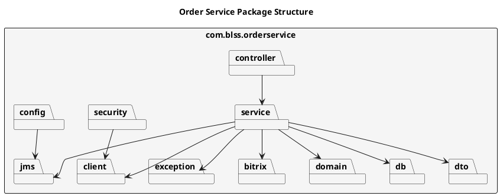
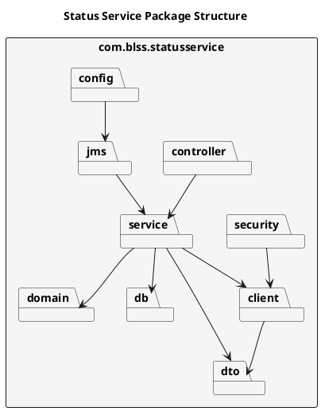
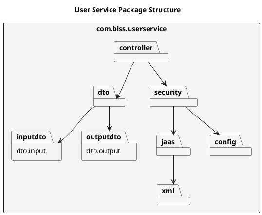
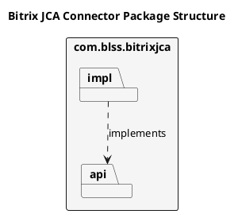
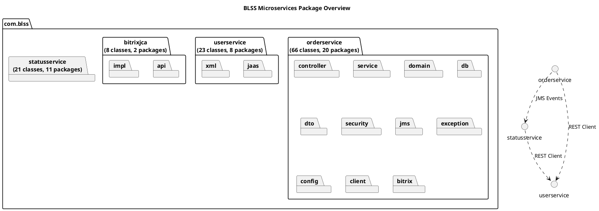

# Package Diagrams

## 1. Order Service

```plantuml
@startuml
title Order Service Package Structure

skinparam packageStyle rectangle
skinparam arrowsColor #555555
skinparam packageBackgroundColor #F5F5F5
skinparam nodesep 40
skinparam ranksep 50

package "com.blss.orderservice" {

    package "controller" as controller
    package "service" as service
    package "domain" as domain
    package "db" as db
    package "dto" as dto
    package "security" as security
    package "jms" as jms
    package "exception" as exception
    package "config" as config
    package "client" as client
    package "bitrix" as bitrix

}

' Main layer dependencies
controller --> service
service --> domain
service --> db
service --> dto

' JMS and config
service --> jms
config --> jms

' Exception handling
service --> exception

' Client
service --> client

' Bitrix integration
service --> bitrix

' Security
security --> client

@enduml
```

## 2. Status Service

```plantuml
@startuml
title Status Service Package Structure

skinparam packageStyle rectangle
skinparam arrowsColor #555555
skinparam packageBackgroundColor #F5F5F5
skinparam nodesep 40
skinparam ranksep 50

package "com.blss.statusservice" {

    package "controller" as controller
    package "service" as service
    package "domain" as domain
    package "db" as db
    package "dto" as dto
    package "security" as security
    package "jms" as jms
    package "config" as config
    package "client" as client

}

' Main layer dependencies
controller --> service
service --> domain
service --> db
service --> dto

' JMS - consumer receives messages
jms --> service
config --> jms

' Client - service calls other services
service --> client
client --> dto

' Security
security --> client

@enduml
```

## 3. User Service

```plantuml
@startuml
title User Service Package Structure

skinparam packageStyle rectangle
skinparam arrowsColor #555555
skinparam packageBackgroundColor #F5F5F5
skinparam nodesep 40
skinparam ranksep 50

package "com.blss.userservice" {

    package "controller" as controller
    package "dto" as dto
    package "security" as security
    package "jaas" as jaas
    package "xml" as xml
    package "config" as config

    package "dto.input" as inputdto
    package "dto.output" as outputdto
}

' Main layer dependencies
controller --> dto
dto --> inputdto
dto --> outputdto

' Security chain
controller --> security
security --> jaas
jaas --> xml
security --> config

@enduml
```

## 4. Bitrix JCA Connector

```plantuml
@startuml
title Bitrix JCA Connector Package Structure

skinparam packageStyle rectangle
skinparam arrowsColor #555555
skinparam packageBackgroundColor #F5F5F5

package "com.blss.bitrixjca" {

    package "api" as api
    package "impl" as impl
}

' Implementation provides API
impl ..> api : implements

@enduml
```

## 5. Complete System Overview

```plantuml
@startuml
title BLSS Microservices Package Overview

package "com.blss" {
    
    package "orderservice\n(66 classes, 20 packages)" {
        package controller
        package service
        package domain
        package db
        package dto
        package security
        package jms
        package exception
        package config
        package client
        package bitrix
    }
    
    package "statusservice\n(21 classes, 11 packages)" {
        package controller
        package service
        package domain
        package db
        package dto
        package security
        package jms
        package config
        package client
    }
    
    package "userservice\n(23 classes, 8 packages)" {
        package controller
        package dto
        package security
        package jaas
        package xml
        package config
    }
    
    package "bitrixjca\n(8 classes, 2 packages)" {
        package api
        package impl
    }
}

' Inter-service communication
orderservice ..> statusservice : JMS Events
orderservice ..> userservice : REST Client
statusservice ..> userservice : REST Client

@enduml
```
