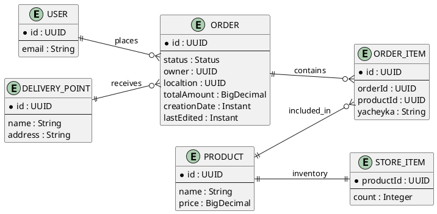

# Доменная модель

## Сущности домена

### 1. `DeliveryPoint`
Точка выдачи заказов.

Поля:
- `id: UUID`
- `name: String`
- `address: String`

### 2. `Product`
Товар в каталоге.

Поля:
- `id: UUID`
- `name: String`
- `price: BigDecimal`

### 3. `User`
Пользователь (клиент).

Поля:
- `id: UUID`
- `email: String`

### 4. `Order`
Заказ пользователя.

Поля:
- `id: UUID`
- `status: Status`
- `owner: UUID`
- `localtion: UUID` (идентификатор ПВЗ)
- `totalAmount: BigDecimal`
- `creationDate: Instant`
- `lastEdited: Instant`

### 5. `OrderItem`
Позиция заказа.

Поля:
- `id: UUID`
- `orderId: UUID`
- `productId: UUID`
- `yacheyka: String`

### 6. `StoreItem`
Остаток товара на складе.

Поля:
- `productId: UUID`
- `count: Integer`

### 7. `Status`
Статус заказа (enum):
- `CREATED`
- `PROCESSING`
- `IN_DELIVERY`
- `READY_FOR_PICKUP`
- `CANCELED`
- `DONE`

## Связи между сущностями

- Один `User` может иметь много `Order`.
- Один `DeliveryPoint` может быть связан со многими `Order`.
- Один `Order` содержит много `OrderItem`.
- Каждый `OrderItem` ссылается на один `Product`.
- Для каждого `Product` хранится один `StoreItem` с текущим остатком.

## Диаграмма доменной модели

