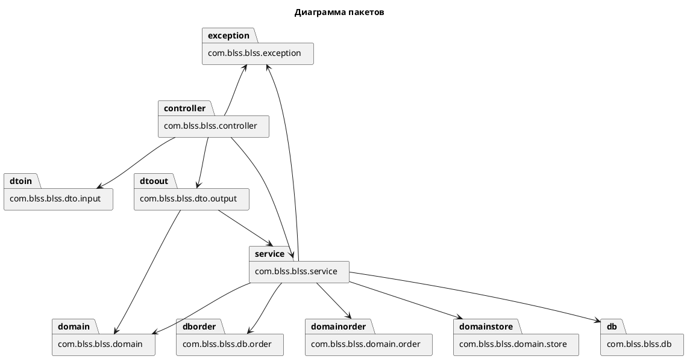
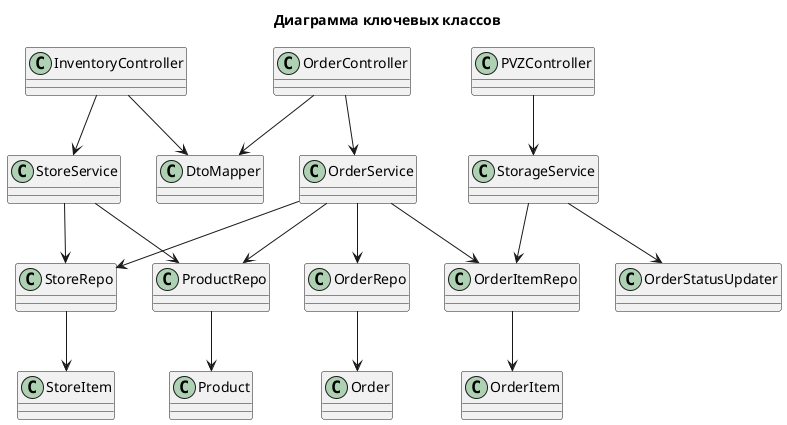

# Текст задания

**Модель потока управления (BPMN)**
Модель процесса представлена в файле `docs/diagram (1).bpmn`. Она описывает взаимодействие консультанта, складской системы и клиента при выдаче заказа, включая проверку заказа, подготовку товара, выдачу или отказ с возвратом.

**UML-диаграммы классов и пакетов**
Ниже приведены UML-диаграммы в формате PlantUML.

**Спецификация REST API (публичные интерфейсы)**
Базовый URL: `http://localhost:8080`

Инвентарь:
- `POST /inventory/products` — создать товар на складе. Тело: `ProductCreateRequestDto` (`name`, `price`, `initialCount`).
- `PUT /inventory/products/{id}` — обновить товар (имя/цена). Тело: `ProductUpdateRequestDto`.
- `PATCH /inventory/products/{id}/count?change=...` — изменить остаток товара.
- `GET /inventory/products/{id}` — получить товар с остатком.
- `GET /inventory/products` — список товаров с остатками.
- `GET /inventory/products/{id}/count` — получить количество товара на складе.

Заказы:
- `POST /order/create` — создать заказ. Тело: `OrderCreateRequestDTO`.
- `GET /order/{id}` — получить детали заказа.
- `PATCH /order/{id}/status?status=...` — изменить статус заказа.

ПВЗ:
- `POST /mark-delivered` — отметить доставку позиции заказа. Тело: `OrderItemDeliveredDto`.

**Исходный код системы**
Исходный код расположен в рабочем каталоге: `C:\Users\admin\IdeaProjects\blss-java`.

**Выводы по работе**
В ходе работы реализованы публичные API для управления товарами на складе и базовые операции по заказам и обработке доставки. Сервисный слой обеспечивает основную бизнес-логику, а контроллеры предоставляют простой REST-интерфейс. Процесс в BPMN синхронизирован с ключевыми действиями системы: проверка заказа, подготовка товара, выдача и обновление статусов. Диаграммы UML отражают структуру приложения и зависимости между слоями.
