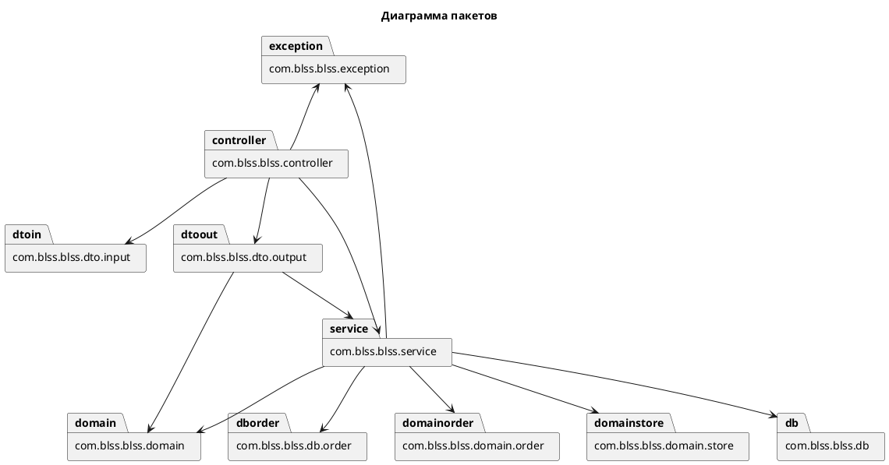
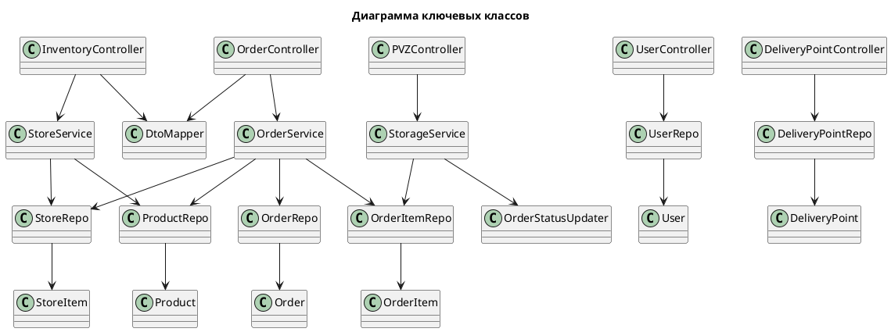

# Текст задания

**Модель потока управления (BPMN)**  
Модель процесса представлена в файле `docs/diagram (1).bpmn`. Она описывает взаимодействие консультанта, складской системы и клиента при выдаче заказа, включая проверку заказа, подготовку товара, выдачу или отказ с возвратом.

**UML‑диаграммы классов и пакетов**  
Ниже приведены UML‑диаграммы в формате PlantUML.

```plantuml
@startuml
title Диаграмма пакетов
package "com.blss.blss.controller" as controller
package "com.blss.blss.service" as service
package "com.blss.blss.db" as db
package "com.blss.blss.db.order" as dborder
package "com.blss.blss.domain" as domain
package "com.blss.blss.domain.order" as domainorder
package "com.blss.blss.domain.store" as domainstore
package "com.blss.blss.dto.input" as dtoin
package "com.blss.blss.dto.output" as dtoout
package "com.blss.blss.exception" as exception

controller --> service
controller --> dtoin
controller --> dtoout
service --> db
service --> dborder
service --> domain
service --> domainorder
service --> domainstore
dtoout --> domain
dtoout --> service
exception <-- controller
exception <-- service
@enduml
```

```plantuml
@startuml
title Диаграмма ключевых классов

class InventoryController
class OrderController
class PVZController
class UserController
class DeliveryPointController

class StoreService
class OrderService
class StorageService

class Product
class StoreItem
class Order
class OrderItem
class User
class DeliveryPoint

class ProductRepo
class StoreRepo
class OrderRepo
class OrderItemRepo
class UserRepo
class DeliveryPointRepo

InventoryController --> StoreService
InventoryController --> "DtoMapper"

OrderController --> OrderService
OrderController --> "DtoMapper"

PVZController --> StorageService

UserController --> UserRepo
DeliveryPointController --> DeliveryPointRepo

StoreService --> ProductRepo
StoreService --> StoreRepo

OrderService --> ProductRepo
OrderService --> StoreRepo
OrderService --> OrderRepo
OrderService --> OrderItemRepo

StorageService --> OrderItemRepo
StorageService --> "OrderStatusUpdater"

ProductRepo --> Product
StoreRepo --> StoreItem
OrderRepo --> Order
OrderItemRepo --> OrderItem
UserRepo --> User
DeliveryPointRepo --> DeliveryPoint
@enduml
```

**Спецификация REST API (публичные интерфейсы)**  
Базовый URL: `http://localhost:8080`

Инвентарь:
- `POST /inventory/products` — создать товар на складе. Тело: `ProductCreateRequestDto` (`name`, `price`, `initialCount`).
- `PUT /inventory/products/{id}` — обновить товар (имя/цена). Тело: `ProductUpdateRequestDto`.
- `PATCH /inventory/products/{id}/count?change=...` — изменить остаток товара.
- `GET /inventory/products/{id}` — получить товар с остатком.
- `GET /inventory/products` — список товаров с остатками.
- `GET /inventory/products/{id}/count` — получить количество товара на складе.

Заказы:
- `POST /order/create` — создать заказ. Тело: `OrderCreateRequestDTO`.
- `GET /order/{id}` — получить детали заказа.
- `PATCH /order/{id}/status?status=...` — изменить статус заказа.

ПВЗ:
- `POST /mark-delivered` — отметить доставку позиции заказа. Тело: `OrderItemDeliveredDto`.

Справочники:
- `POST /users` — создать пользователя. Тело: `UserCreateRequestDto` (`email`).
- `POST /delivery-points` — создать пункт выдачи. Тело: `DeliveryPointCreateRequestDto` (`name`, `address`).

**Исходный код системы**  
Исходный код расположен в каталоге: `C:\Users\admin\IdeaProjects\blss-java`.

**Выводы по работе**  
В ходе работы реализованы публичные API для управления товарами, заказами и обработкой выдачи. Сервисный слой покрывает основную бизнес‑логику, контроллеры предоставляют REST‑интерфейс. BPMN‑модель синхронизирована с ключевыми действиями системы (проверка заказа, подготовка товара, выдача и обновление статусов), а UML‑диаграммы отражают структуру приложения и зависимости между слоями.
