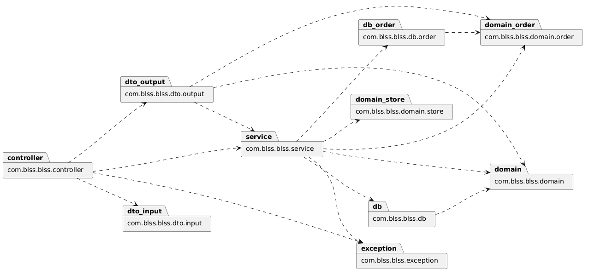
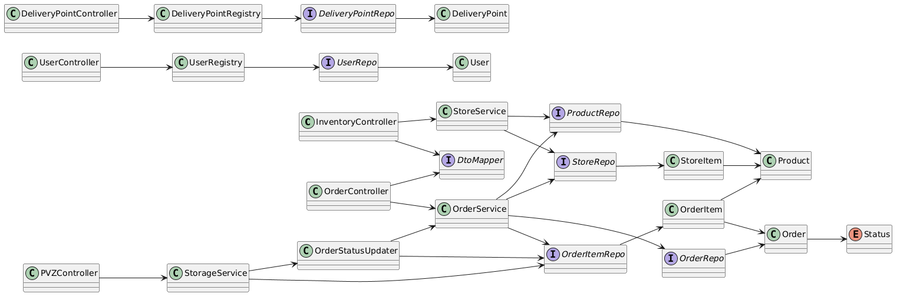
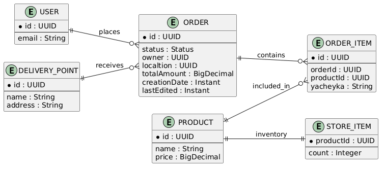

<div align="center">

Федеральное государственное автономное образовательное учреждение высшего образования

Университет ИТМО

</div>

**Факультет:** ПИиКТ

<div align="center">

Дисциплина: **Бизнес-логика программных систем**

# Лабораторная работа №1

## Автоматизация бизнес-процесса выдачи заказа

**Вариант:** 3201

</div>

**Выполнили:** Амузинский Артем, Тараненко Максим  

**Группа:** P3306, P3311

**Преподаватель:** Кривоносов Егор Дмитриевич

<div align="center">


2026 г.  
Санкт-Петербург

</div>

<div style="page-break-after: always;"></div>

## Задание по лабораторной работе

**Вариант №:** 3201
**Название варианта:** `Автоматизация бизнес-процесса выдачи заказа клиенту в пункте выдачи`

### Полный текст задания

Ниже приведен текст задания, восстановленный по материалам репозитория и реализованному варианту. Поля с номером варианта и персональными данными на титульном листе нужно заполнить фактическими значениями.

Необходимо разработать приложение, автоматизирующее процесс выдачи заказа клиенту. Для выбранного варианта требуется:

1. Смоделировать поток управления автоматизируемого бизнес-процесса в BPMN.
2. Спроектировать структуру приложения и описать ее UML-диаграммами классов и пакетов.
3. Спроектировать и реализовать REST API для публичных интерфейсов системы.
4. Реализовать серверное приложение, покрывающее ключевые сущности предметной области:
   пользователь, пункт выдачи, товар, складской остаток, заказ, позиция заказа.
5. Реализовать основную бизнес-логику процесса выдачи заказа:
   создание заказа, учет остатков, продвижение по статусам, фиксация размещения позиции заказа в ячейке ПВЗ.
6. Подготовить исходный код проекта и инструкции по настройке, запуску и развертыванию.
7. Подготовить отчет, содержащий текст задания, модель потока управления, UML-диаграммы, спецификацию REST API, исходный код или ссылку на репозиторий и выводы по работе.

<div style="page-break-after: always;"></div>

## Текст задания

Задание реализуется для варианта автоматизации процесса выдачи заказа клиенту. Пользователь оформляет заказ, система резервирует и списывает складские остатки, заказ проходит последовательность статусов, а сотрудник ПВЗ фиксирует размещение позиций по ячейкам. После обработки всех позиций заказ переводится в состояние готовности к выдаче, а затем может быть завершен или отменен.

## Модель потока управления для автоматизируемого бизнес-процесса

Модель процесса подготовлена в файле `docs/diagram (1).bpmn`. Она описывает следующий сценарий:

1. Создание заказа клиентом.
2. Проверка и обработка заказа системой.
3. Перевод заказа в доставку.
4. Размещение позиций заказа в ячейках ПВЗ.
5. Перевод заказа в статус готовности к выдаче.
6. Завершение выдачи заказа клиенту или отмена заказа.

Состояния заказа в реализованной системе:

- `CREATED`
- `PROCESSING`
- `IN_DELIVERY`
- `READY_FOR_PICKUP`
- `CANCELED`
- `DONE`

## UML-диаграммы классов и пакетов разработанного приложения

### Диаграмма пакетов



Основные пакеты приложения:

- `controller` отвечает за REST-интерфейсы.
- `service` инкапсулирует бизнес-логику.
- `db` и `db.order` работают с persistence-слоем.
- `domain`, `domain.order`, `domain.store` содержат сущности предметной области.
- `dto.input` и `dto.output` описывают контракт запросов и ответов.
- `exception` содержит прикладные исключения.

### Диаграмма классов



### Диаграмма доменной модели



Ключевые сущности предметной области:

- `User`, `DeliveryPoint`, `Product`.
- `Order` и `OrderItem`.
- `StoreItem` для учета складских остатков.
- `Status` для жизненного цикла заказа.

## Спецификация REST API для всех публичных интерфейсов разработанного приложения

Приложение запускается на `http://localhost:21001`.

Все успешные ответы, кроме пустых, оборачиваются в объект вида:

```json
{
  "data": "...",
  "timestamp": "2026-03-22T12:00:00Z",
  "endpoint": "/inventory/products"
}
```

Ошибки возвращаются в формате:

```json
{
  "message": "Описание ошибки",
  "timestamp": "2026-03-22T12:00:00Z",
  "endpoint": "/order/{id}",
  "id": "uuid"
}
```

### Пользователи

- `POST /users`
  Создает пользователя.
  Тело запроса: `UserCreateRequestDto { email }`.

### Пункты выдачи

- `POST /delivery-points`
  Создает пункт выдачи.
  Тело запроса: `DeliveryPointCreateRequestDto { name, address }`.

### Склад и каталог товаров

- `POST /inventory/products`
  Создает товар и начальный остаток.
  Тело запроса: `ProductCreateRequestDto { name, price, initialCount }`.

- `PUT /inventory/products/{id}`
  Обновляет наименование и цену товара.
  Тело запроса: `ProductUpdateRequestDto { name, price }`.

- `PATCH /inventory/products/{id}/count?change={delta}`
  Изменяет количество товара на складе.

- `GET /inventory/products/{id}`
  Возвращает товар и текущий остаток.

- `GET /inventory/products`
  Возвращает список всех товаров с остатками.

- `GET /inventory/products/{id}/count`
  Возвращает только количество товара на складе.

### Заказы

- `POST /order/create`
  Создает заказ.
  Тело запроса: `OrderCreateRequestDTO { owner, location, productIds }`.

- `GET /order/{id}`
  Возвращает заказ, владельца, дату создания, статус, сумму и список позиций.

- `PATCH /order/{id}/status/next`
  Переводит заказ на следующий этап жизненного цикла:
  `CREATED -> PROCESSING -> IN_DELIVERY -> READY_FOR_PICKUP -> DONE`.

- `PATCH /order/{id}/status/cancel`
  Публичный endpoint для отмены заказа.

### Операции ПВЗ

- `POST /mark-delivered`
  Проставляет ячейку для позиции заказа.
  Тело запроса: `OrderItemDeliveredDto { itemId, yacheyka }`.
  После заполнения ячеек для всех позиций заказ может быть автоматически переведен в `READY_FOR_PICKUP`.

## Исходный код системы или ссылка на репозиторий с исходным кодом

Исходный код доступен в репозитории:  
`https://github.com/GrozniyMax/blss`

Основные каталоги проекта:

- `src/main/java` - исходный код приложения.
- `src/main/resources` - конфигурация и Liquibase-миграции.
- `src/main/test` - HTTP-сценарии для ручной проверки API.
- `docs` - отчет, BPMN-модель и диаграммы.

## Инструкции по настройке, деплою и развертыванию лабораторной работы

### Требования к окружению

- Java 17.
- Docker и Docker Compose.
- Свободный порт `5432` для PostgreSQL.
- Свободный порт `21001` для Spring Boot приложения.

### Подготовка окружения

1. Убедиться, что в корне проекта присутствует файл `.env` с параметрами:

```env
POSTGRES_DB=studs
POSTGRES_USER=...
POSTGRES_PASSWORD=...
```

2. Поднять PostgreSQL:

```powershell
docker compose up -d postgres
```

3. При необходимости поднять pgAdmin:

```powershell
docker compose up -d pgadmin
```

pgAdmin будет доступен по адресу `http://localhost:6980`.

### Запуск приложения

Запуск из корня проекта:

```powershell
.\gradlew.bat bootRun
```

После старта приложения Liquibase автоматически применит миграции. Сервис будет доступен по адресу `http://localhost:21001`.

### Проверка работоспособности

Для ручной проверки можно использовать файлы:

- `src/main/test/users.http`
- `src/main/test/delivery_points.http`
- `src/main/test/inventory.http`
- `src/main/test/order.http`
- `src/main/test/pvz.http`

Важно: в текущих `.http`-файлах указан `http://localhost:8080`, а фактический порт приложения в конфигурации проекта равен `21001`. Перед запуском сценариев нужно заменить `baseUrl` либо переопределить `server.port`.

### Развертывание

Текущая версия проекта ориентирована на локальное развертывание как Spring Boot сервис с внешней PostgreSQL-базой данных. Отдельный production-контур, Dockerfile для приложения и CI/CD-пайплайн для выкладки в репозитории не настроены.

## Выводы по работе

В ходе выполнения лабораторной работы были изучены:

- моделирование бизнес-процесса в BPMN;
- проектирование REST API и DTO-контрактов;
- построение многослойного Spring Boot приложения;
- работа с PostgreSQL и Liquibase-миграциями;
- управление жизненным циклом заказа и синхронизация статусов с действиями ПВЗ.

Практический результат работы состоит в создании сервиса, который связывает складской учет, оформление заказа и подготовку к выдаче в единую бизнес-логику. По ходу выполнения ЛР стало понятно, что "еще один маленький endpoint" почти всегда превращается в миграции, валидацию, статусы, обработку ошибок и обновление отчета.
