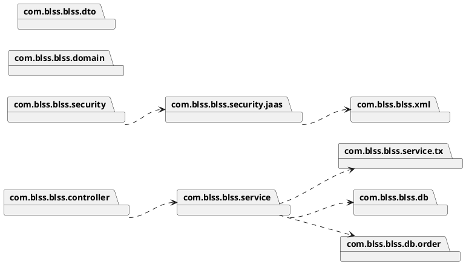
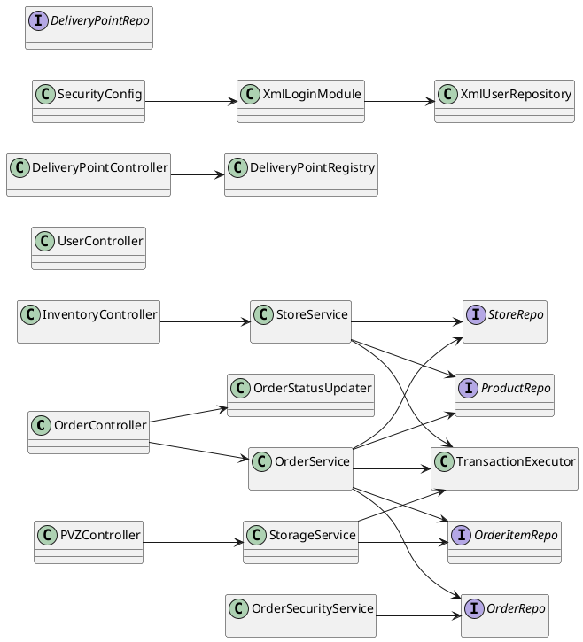



Федеральное государственное автономное образовательное учреждение высшего образования

Университет ИТМО

**Факультет:** ПИиКТ

Дисциплина: **Бизнес-логика программных систем**

# Лабораторная работа №2

**Вариант:** 192

**Выполнили:** Амузинский Артем, Тараненко Максим

**Группа:** P3306, P3311

**Преподаватель:** Кривоносов Егор Дмитриевич

2026 г.  
Санкт-Петербург

# Отчёт по лабораторной работе

## 1. Текст задания

### 1.1 Управление транзакциями

- Переработать согласованные с преподавателем прецеденты, объединив взаимозависимые операции в рамках транзакций.
- Реализовать управление транзакциями с помощью Spring JTA.
- Использовать программное управление транзакциями в реализованных/модифицированных прецедентах.
- Использовать в качестве менеджера транзакций Jakarta EE JTA, преобразовав приложение в WAR для развёртывания на WildFly.

### 1.2 Разграничение доступа к операциям

- Разработать и специфицировать набор привилегий для разграничения доступа к операциям.
- Специфицировать набор ролей для доступа к операциям бизнес-логики.
- Реализовать модель доступа на базе Spring Security + JAAS.
- Хранить учётные записи в XML, для аутентификации использовать HTTP Basic.

### 1.3 Правила выполнения

- Все изменения бизнес-процесса должны быть отражены в модели, REST API и скриптах тестирования.
- Доработанное приложение должно быть развёрнуто на сервере helios.

## 2. Модель потока управления бизнес-процесса

Модель процесса представлена в BPMN-диаграммах:
- `docs/diagram (1).bpmn` — основной поток обработки и выдачи заказа.
- `docs/diagram-roles.bpmn` — роли и зоны ответственности участников процесса.

Ключевые этапы процесса:
1. Создание заказа и резервирование/списание товарных позиций.
2. Перевод заказа по статусам (`CREATED -> PROCESSING -> IN_DELIVERY -> READY_FOR_PICKUP -> DONE`), либо отмена (`CANCELED`).
3. Отметка доставки позиции в ПВЗ и переход заказа в `READY_FOR_PICKUP` при готовности всех позиций.
4. Выдача/закрытие заказа либо отмена.

## 3. Реализация и проверка управления транзакциями

### 3.1 Выбранные прецеденты с транзакционными границами

1. Создание заказа:
- в одной транзакции выполняются проверки, уменьшение остатков, создание заказа и создание позиций заказа.
- реализация: `OrderService.createOrder(...)`.

2. Создание товара:
- в одной транзакции создаются карточка товара и запись остатков на складе.
- реализация: `StoreService.createProduct(...)`.

3. Обновление товара и остатков:
- операции изменения сущностей склада выполняются программно в транзакции.
- реализация: `StoreService.updateProduct(...)`, `StoreService.updateItemsCount(...)`.

4. Создание пункта выдачи:
- проверка уникальности и сохранение точки выполняются в транзакции.
- реализация: `DeliveryPointRegistry.createDeliveryPoint(...)`.

5. Обновление позиции заказа в ПВЗ:
- обновление ячейки позиции выполняется в транзакции.
- реализация: `StorageService.updateYacheyka(...)`.

### 3.2 Spring JTA + программное управление

- Используется `JtaTransactionManager` и `TransactionTemplate` (Spring JTA).
- Программное управление вынесено в `TransactionExecutor` (`inTransaction(...)`).
- Аннотационный подход (`@Transactional`) в сервисах не используется как основной механизм; транзакции открываются явно через `TransactionExecutor`.

### 3.3 Jakarta EE JTA и WildFly

- `UserTransaction` и `TransactionManager` берутся из JNDI контейнера:
  - `java:comp/UserTransaction`
  - `java:/TransactionManager`
- Источник данных подключается по JNDI (`java:jboss/PostgresDS`).
- Проект собирается как `war` и запускается как servlet-приложение (`SpringBootServletInitializer`).
- Конфигурация WildFly присутствует в `src/main/webapp/WEB-INF`.

### 3.4 Результат проверки

- Сборка `bootWar` выполнена успешно.
- Полученный артефакт: `build/libs/blss-0.0.1-SNAPSHOT.war`.

## 4. Спецификация привилегий и ролей

### 4.1 Роли

- `ADMIN` — полный доступ ко всем операциям.
- `MANAGER` — управление товарами/остатками, ПВЗ, просмотр и изменение заказов.
- `CONSULTANT` — просмотр заказов и перевод по статусам.
- `WAREHOUSE` — отметка доставки позиций (`/mark-delivered`).
- `USER` — создание заказов и доступ только к своим заказам.

### 4.2 Привилегии (по операциям)

1. Пользователи:
- `POST/GET/PATCH/DELETE /users/**` — только `ADMIN`.

2. Заказы:
- `POST /order/**` — `USER`, `ADMIN`.
- `GET /order/**` — `USER`, `CONSULTANT`, `MANAGER`, `ADMIN`.
- `PATCH /order/**` — `CONSULTANT`, `MANAGER`, `ADMIN`.
- Дополнительные объектные проверки: `OrderSecurityService` для доступа к конкретному заказу и создания заказа от имени владельца.

3. Склад:
- `/inventory/**` (POST/PUT/PATCH/GET) — `MANAGER`, `ADMIN`.

4. ПВЗ:
- `POST /mark-delivered` — `WAREHOUSE`, `ADMIN`.
- `/delivery-points/**` — `MANAGER`, `ADMIN`.

### 4.3 Spring Security + JAAS + XML + HTTP Basic

- Аутентификация: HTTP Basic.
- Авторизация: `SecurityFilterChain` + `@PreAuthorize`.
- JAAS: `DefaultJaasAuthenticationProvider` + `XmlLoginModule`.
- Учётные записи: XML-файл (`users.xml`, путь задаётся `security.users.xml-path`).

## 5. UML-диаграммы классов и пакетов

### 5.1 Диаграмма пакетов

```plantuml
@startuml
left to right direction
skinparam packageStyle rectangle

package "com.blss.blss.controller"
package "com.blss.blss.service"
package "com.blss.blss.service.tx"
package "com.blss.blss.db"
package "com.blss.blss.db.order"
package "com.blss.blss.security"
package "com.blss.blss.security.jaas"
package "com.blss.blss.xml"
package "com.blss.blss.domain"
package "com.blss.blss.dto"

"com.blss.blss.controller" ..> "com.blss.blss.service"
"com.blss.blss.service" ..> "com.blss.blss.db"
"com.blss.blss.service" ..> "com.blss.blss.db.order"
"com.blss.blss.service" ..> "com.blss.blss.service.tx"
"com.blss.blss.security" ..> "com.blss.blss.security.jaas"
"com.blss.blss.security.jaas" ..> "com.blss.blss.xml"
@enduml
```

### 5.2 Диаграмма классов (ключевые)

```plantuml
@startuml
left to right direction

class OrderController
class InventoryController
class UserController
class PVZController
class DeliveryPointController

class OrderService
class StoreService
class StorageService
class OrderStatusUpdater
class DeliveryPointRegistry
class TransactionExecutor

class SecurityConfig
class OrderSecurityService
class XmlLoginModule
class XmlUserRepository

interface OrderRepo
interface OrderItemRepo
interface ProductRepo
interface StoreRepo
interface DeliveryPointRepo

OrderController --> OrderService
OrderController --> OrderStatusUpdater
InventoryController --> StoreService
PVZController --> StorageService
DeliveryPointController --> DeliveryPointRegistry

OrderService --> OrderRepo
OrderService --> OrderItemRepo
OrderService --> ProductRepo
OrderService --> StoreRepo
OrderService --> TransactionExecutor

StoreService --> ProductRepo
StoreService --> StoreRepo
StoreService --> TransactionExecutor

StorageService --> OrderItemRepo
StorageService --> TransactionExecutor

SecurityConfig --> XmlLoginModule
OrderSecurityService --> OrderRepo
XmlLoginModule --> XmlUserRepository
@enduml
```

## 6. Спецификация REST API публичных интерфейсов

Базовый префикс: `/`

### 6.1 Аутентификация и пользователи

- `POST /auth/register` — регистрация пользователя (роль `USER` по умолчанию).
- `POST /users` — создание пользователя (`ADMIN`).
- `GET /users` — список пользователей (`ADMIN`).
- `GET /users/{username}` — карточка пользователя (`ADMIN`).
- `PATCH /users/{username}` — обновление пользователя (`ADMIN`).
- `DELETE /users/{username}` — удаление пользователя (`ADMIN`).

### 6.2 Товары и склад

- `POST /inventory/products` — создание товара.
- `PUT /inventory/products/{id}` — обновление товара.
- `PATCH /inventory/products/{id}/count?change=...` — изменение остатка.
- `GET /inventory/products/{id}` — получить товар.
- `GET /inventory/products` — список товаров.
- `GET /inventory/products/{id}/count` — текущий остаток.

### 6.3 Заказы

- `POST /order/create` — создать заказ.
- `GET /order/{id}` — получить состав/состояние заказа.
- `PATCH /order/{id}/status/next` — перевод на следующий статус.
- `PATCH /order/{id}/status/cancel` — отмена заказа.

### 6.4 ПВЗ

- `POST /delivery-points` — создать пункт выдачи.
- `POST /mark-delivered` — отметить позицию заказа доставленной в ячейку ПВЗ.

## 7. Согласованность изменений (модель, API, тестовые скрипты)

Изменения в бизнес-процессе отражены в:
- BPMN-моделях: `docs/diagram (1).bpmn`, `docs/diagram-roles.bpmn`.
- REST API (контроллеры и DTO).
- Наборе HTTP-скриптов для проверки публичных интерфейсов:
  - `src/main/test/e2e_all_endpoints.http`
  - `src/main/test/order.http`
  - `src/main/test/inventory.http`
  - `src/main/test/pvz.http`
  - `src/main/test/delivery_points.http`
  - `src/main/test/users.http`

## 8. Развёртывание на helios

Приложение подготовлено к развёртыванию на WildFly (WAR, JNDI DataSource, JTA от контейнера).

Рекомендуемая последовательность для helios:
1. Собрать артефакт: `./gradlew bootWar -x test`.
2. Скопировать `build/libs/blss-0.0.1-SNAPSHOT.war` в deployments WildFly на helios.
3. Убедиться, что на сервере настроен `java:jboss/PostgresDS`.
4. Передать путь к XML пользователей через `SECURITY_USERS_XML_PATH`.

## 9. Исходный код

- Локальный исходный код: текущий репозиторий `blss-java`.
- Публичный репозиторий: https://github.com/GrozniyMax/blss

## 10. Выводы по работе

1. Транзакционное управление реализовано в программном стиле через Spring JTA (`TransactionTemplate` + `TransactionExecutor`) с использованием Jakarta EE JTA-менеджера WildFly.
2. Ключевые взаимозависимые операции (создание заказа, работа со складом, создание ПВЗ) объединены в транзакционные сценарии.
3. Реализована ролевая модель доступа (RBAC) на Spring Security + JAAS с хранением учётных записей в XML и аутентификацией по HTTP Basic.
4. Изменения синхронизированы с BPMN, REST API и HTTP-скриптами для тестирования публичных интерфейсов.
